# Azure Contents Generator

Azure 관련 PPT 자료를 **최신 정보로 자동 업데이트**하는 CI/CD 파이프라인 프로젝트입니다.
업데이트 본문과 **PR 설명까지** **GitHub Models** 또는 **GitHub Copilot CLI (Cloud Agent)** 가
본 레포의 자체 작성 가이드 [`skills/pptx-local/`](./skills/pptx-local/) 를 따라 작성합니다.
기본 옵션은 **별도 API 키 없이 `GITHUB_TOKEN` 만으로** 동작합니다.

자세한 설계는 [`setup.md`](./setup.md) 참고.

---

## 🧭 동작 방식 한눈에 보기

```mermaid
flowchart LR
    A([cron 또는 수동 실행]) --> B[Checkout<br/>+ LFS]
    B --> C["skills/pptx-local 로드<br/>레포 내 자체 가이드"]
    C --> D[Azure RSS 수집<br/>fetch_azure_updates.py]
    D --> E{LLM 엔진}
    E -- models 기본<br/>GITHUB_TOKEN --> F1[GitHub Models 호출<br/>llm_summarize.py]
    E -- copilot 옵션<br/>COPILOT_GITHUB_TOKEN --> F2[GitHub Copilot CLI<br/>cloud agent]
    F1 --> G[summary.md + pr_body.md]
    F2 --> G
    G --> H[python-pptx 로 슬라이드 삽입<br/>update_ppt.py]
    H --> I[LibreOffice + poppler<br/>PDF/PNG 미리보기]
    I --> J[releases/&lt;timestamp&gt;/ 에 모두 누적<br/>PPTX · PDF · PNG · summary · pr_body]
    J --> K[update_releases_index.py<br/>루트 README 자동 갱신]
    K --> L[peter-evans/create-pull-request<br/>본문 = pr_body.md]
    L --> M([📬 PR 생성 - 검토 후 머지])
```



### 단계별 핵심
| 단계 | 무엇이 | 어디에 |
|------|--------|--------|
| 수집 | Microsoft 공식 RSS 20건 | `.cache/updates.json` |
| 요약 | LLM 이 한국어 슬라이드 본문 + PR 설명 작성 | `.cache/summary.md` · `.cache/pr_body.md` |
| 편집 | `python-pptx` 로 'Latest Azure Updates' 슬라이드 추가/교체 | `releases/<TS>-<자료명>/*.pptx` |
| 시각화 | LibreOffice 로 PDF, poppler 로 슬라이드별 PNG | 같은 릴리즈 폴더 |
| 가시화 | 루트 README 의 `LATEST` / `RELEASES` 블록을 자동 교체 | `README.md` |
| 검토 | LLM 이 쓴 본문으로 PR 생성, 라벨 `automated`, `ppt-update` | GitHub PR |

> 원본 `samples/*.pptx` 는 **절대 덮어쓰지 않습니다.** 매 실행마다 새 `releases/<timestamp>-<자료명>/` 폴더가 만들어지고, 모든 산출물이 그 안에 모입니다.

### LLM 엔진 선택
| 엔진 | 권한·시크릿 | 특징 |
|------|-------------|------|
| `models` *(기본)* | `permissions: { models: read }` + `GITHUB_TOKEN` | **추가 설정 0**. 무료 티어/엔터프라이즈 공통 |
| `copilot` | `COPILOT_GITHUB_TOKEN` 시크릿 (PAT, *Copilot Requests: Read*) | **Copilot Enterprise/Business/Pro+** 가 있다면 실제 Copilot 에이전트가 skill 파일을 직접 읽고 다중 단계로 작업 |

두 엔진 모두 같은 출력 인터페이스(`summary.md` + `pr_body.md`)를 만들기 때문에, 이후 단계(슬라이드 편집·미리보기·PR 생성)는 동일합니다.

### ⚡ 옵션: Copilot Coding Agent 에 통째로 위임 (워크플로 밖에서 PR 생성)

[`.github/workflows/delegate-to-copilot-agent.yml`](./.github/workflows/delegate-to-copilot-agent.yml) 는
매주(혹은 수동) **task issue 를 생성하고 GitHub Copilot Coding Agent 에 할당**합니다.
이후 PR 작성·커밋은 Actions 가 아닌 **GitHub 호스팅 환경의 Copilot 이 직접** 수행합니다.

| 항목 | 값 |
|---|---|
| 트리거 | `cron: "0 1 * * 1"` (매주 월 10:00 KST) + `workflow_dispatch` |
| 필요한 권한 | `issues: write` (워크플로 기본 토큰) |
| 사전 준비 | 레포 또는 조직 *Settings → Copilot → Coding agent* 에서 활성화 |
| 시크릿 | 기본 `GITHUB_TOKEN` 시도, 조직 정책상 막혀 있으면 `COPILOT_AGENT_PAT` (issues:write PAT) |
| 작업 지침 | issue 본문에 `skills/pptx-local/SKILL.md` 와 추천 실행 스크립트가 자동 포함됨 |

Copilot Coding Agent 가 할당 받으면 **자체 브랜치 → 커밋 → Draft PR** 까지 자동으로 만들어 `Closes #N` 로 issue 와 연결합니다.

---

## 📰 최근 업데이트

각 워크플로 실행은 `releases/<YYYYMMDD-HHMMSS>-<자료명>/` 폴더에
업데이트된 **PPTX · PDF · 슬라이드별 PNG · 요약(summary.md)** 을 모아 저장합니다.
아래 두 블록은 자동 갱신됩니다 (편집하지 마세요).

### 🆕 최신 변경 내용

<!-- LATEST:START -->
**🆕 2026-06-04 01:50:50 KST** — `Microsoft Foundry를 활용한 Agentic AI`

[🖼 전체 슬라이드 미리보기](./releases/20260604-015050-Microsoft%20Foundry%EB%A5%BC%20%ED%99%9C%EC%9A%A9%ED%95%9C%20Agentic%20AI/README.md) · [📄 PDF](./releases/20260604-015050-Microsoft%20Foundry%EB%A5%BC%20%ED%99%9C%EC%9A%A9%ED%95%9C%20Agentic%20AI/Microsoft%20Foundry%EB%A5%BC%20%ED%99%9C%EC%9A%A9%ED%95%9C%20Agentic%20AI.pdf) · [📊 PPTX 다운로드](./releases/20260604-015050-Microsoft%20Foundry%EB%A5%BC%20%ED%99%9C%EC%9A%A9%ED%95%9C%20Agentic%20AI/Microsoft%20Foundry%EB%A5%BC%20%ED%99%9C%EC%9A%A9%ED%95%9C%20Agentic%20AI.pptx) · [📝 요약(summary.md)](./releases/20260604-015050-Microsoft%20Foundry%EB%A5%BC%20%ED%99%9C%EC%9A%A9%ED%95%9C%20Agentic%20AI/summary.md)

#### ✍️ LLM 요약

<blockquote>

최신 Foundry·Azure AI 업데이트 한눈에 보기
- **Foundry Agents in VS Code** 코드 중심 관찰성으로 평가·개선 루프를 에디터에서 실행 (Azure Updates)
- **Azure Cosmos DB Agent Kit** AI 코딩 에이전트에 데이터 모델·쿼리 모범 사례를 내장 (Azure Updates)
- **Azure API Management Unified Model API** 여러 모델 API 형식을 하나로 묶어 교체·거버넌스를 단순화 (Azure Updates)
- **Foundry Models Model Router Policy** 모델 라우팅 기준을 Azure Policy로 중앙 통제 (Azure Updates)
- **Voice Live + Foundry Agent Service** 음성 입출력을 별도 오디오 파이프라인 없이 바로 연결 (Azure Updates)

</blockquote>

#### 🆕 추가된 슬라이드


<details><summary>📑 전체 슬라이드 펼쳐보기</summary>

**Slide 1**


**Slide 2**


**Slide 3**


**Slide 4**


**Slide 5**


**Slide 6**


**Slide 7**


**Slide 8**


**Slide 9**


**Slide 10**


**Slide 11**


**Slide 12**


**Slide 13**


**Slide 14**


**Slide 15**


**Slide 16**


**Slide 17**


**Slide 18**


**Slide 19**


**Slide 20**


**Slide 21**


**Slide 22**


**Slide 23**


**Slide 24**


**Slide 25**


**Slide 26**


**Slide 27**


**Slide 28**


**Slide 29**


</details>

<!-- LATEST:END -->

### 🗂 전체 릴리즈 이력

<!-- RELEASES:START -->
| 시각 (KST) | 자료 | 슬라이드 | 보기 |
|------------|------|----------|------|
| `2026-06-04 01:50:50 KST` | Microsoft Foundry를 활용한 Agentic AI | 29장 | [🖼 미리보기](./releases/20260604-015050-Microsoft%20Foundry%EB%A5%BC%20%ED%99%9C%EC%9A%A9%ED%95%9C%20Agentic%20AI/README.md) · [📄 PDF](./releases/20260604-015050-Microsoft%20Foundry%EB%A5%BC%20%ED%99%9C%EC%9A%A9%ED%95%9C%20Agentic%20AI/Microsoft%20Foundry%EB%A5%BC%20%ED%99%9C%EC%9A%A9%ED%95%9C%20Agentic%20AI.pdf) · [📊 PPTX](./releases/20260604-015050-Microsoft%20Foundry%EB%A5%BC%20%ED%99%9C%EC%9A%A9%ED%95%9C%20Agentic%20AI/Microsoft%20Foundry%EB%A5%BC%20%ED%99%9C%EC%9A%A9%ED%95%9C%20Agentic%20AI.pptx) |
| `2026-06-04 01:43:02 KST` | Microsoft Foundry를 활용한 Agentic AI | 29장 | [🖼 미리보기](./releases/20260604-014302-Microsoft%20Foundry%EB%A5%BC%20%ED%99%9C%EC%9A%A9%ED%95%9C%20Agentic%20AI/README.md) · [📄 PDF](./releases/20260604-014302-Microsoft%20Foundry%EB%A5%BC%20%ED%99%9C%EC%9A%A9%ED%95%9C%20Agentic%20AI/Microsoft%20Foundry%EB%A5%BC%20%ED%99%9C%EC%9A%A9%ED%95%9C%20Agentic%20AI.pdf) · [📊 PPTX](./releases/20260604-014302-Microsoft%20Foundry%EB%A5%BC%20%ED%99%9C%EC%9A%A9%ED%95%9C%20Agentic%20AI/Microsoft%20Foundry%EB%A5%BC%20%ED%99%9C%EC%9A%A9%ED%95%9C%20Agentic%20AI.pptx) |

전체 이력: [`releases/`](./releases/)
<!-- RELEASES:END -->

---

## ⚠️ 1회 설정: Actions 가 PR 을 만들 수 있게 허용

`update-ppt.yml` 의 PR 생성 단계가 `GitHub Actions is not permitted to create or approve pull requests` 로 실패한다면 아래 둘 중 **하나**만 처리하세요.

### 옵션 A · 레포 설정 토글 (가장 쉬움, 추천)
1. 레포 페이지 → **Settings → Actions → General**
2. 가장 아래 **Workflow permissions** 섹션
3. ✅ **Allow GitHub Actions to create and approve pull requests** 체크 후 *Save*

### 옵션 B · 개인 PAT 사용 (조직 정책상 옵션 A 가 막혀 있을 때)
1. https://github.com/settings/tokens?type=beta → **Fine-grained PAT** 생성
2. *Repository access*: 이 레포 / *Repository permissions*: `Contents: Read & write`, `Pull requests: Read & write`
3. 레포 *Settings → Secrets and variables → Actions* 에 **`PR_CREATE_PAT`** 이름으로 등록

워크플로는 `PR_CREATE_PAT` 가 있으면 우선 사용하고, 없으면 기본 `GITHUB_TOKEN` 으로 폴백합니다.

---

## 🧠 PPT Skill (라이선스 안전한 자체 가이드)

LLM·클라우드 에이전트가 PPT 를 다룰 때 따르는 규칙은 본 레포의
[`skills/pptx-local/`](./skills/pptx-local/) 에 직접 작성되어 있습니다.

- [`SKILL.md`](./skills/pptx-local/SKILL.md) — 트리거 규칙, 작성 원칙, 워크플로 내 역할
- [`editing.md`](./skills/pptx-local/editing.md) — `python-pptx` 로 안전하게 슬라이드를 추가/수정하는 방법

> ⚖️ **왜 자체 skill 인가?** Anthropic 의 [`anthropics/skills`](https://github.com/anthropics/skills) 의
> `pptx` skill 은 *Proprietary 라이선스* 라 레포에 복사·재배포가 금지됩니다. 본 레포는 그
> 아이디어를 참고해 **저자 직접 작성**한 자체 가이드를 사용합니다 (자유롭게 수정·재사용 가능).
> 워크플로는 **참고용으로만** `anthropics/skills` 를 런타임 sparse-checkout 으로 받을 수 있고
> (실패해도 무시), 1차 컨텍스트는 항상 `skills/pptx-local/` 입니다.

---

## 🚀 GitHub에 푸시하기 (최초 1회)

### 1) GitHub에서 빈 저장소 생성

브라우저에서 https://github.com/new 로 이동:
- Repository name: `azure-contents-generator`
- README/.gitignore/license 체크 **모두 해제**

### 2) 첫 푸시

```bash
cd /Users/kichul/Documents/project/azure-contents-generator/azure-contents-generator

# (이미 git init + 첫 커밋은 완료되어 있음. 안전을 위해 확인)
git status
git log --oneline

# 본인 GitHub 사용자명/조직으로 교체
git remote add origin https://github.com/<USER>/azure-contents-generator.git
git push -u origin main
```

### 3) Actions 권한 확인

**Settings → Actions → General → Workflow permissions**:
- `Read and write permissions`
- `Allow GitHub Actions to create and approve pull requests`

LLM 사용 방식은 두 가지 중 선택:

| 엔진 | 필요 권한 | 비고 |
|------|-----------|------|
| **GitHub Models** *(기본)* | 워크플로의 `permissions: { models: read }` 만으로 자동 | **별도 Secret 불필요.** 무료 티어/엔터프라이즈 공통 |
| **GitHub Copilot CLI** *(Cloud Agent)* | `COPILOT_GITHUB_TOKEN` 시크릿 (Fine-grained PAT, *Copilot Requests: Read* 권한) | **Copilot Enterprise/Business/Pro+ 라이선스 필요.** 진짜 자율 에이전트가 skill 을 직접 읽고 실행 |

> Copilot CLI 를 쓰려면 **Settings → Secrets and variables → Actions → New repository secret**
> 에서 `COPILOT_GITHUB_TOKEN` 이름으로 PAT 를 등록한 뒤,
> 워크플로 실행 시 `engine = copilot` 을 선택하세요.

---

## 🔁 PPT 업데이트 실행 & 결과 확인

### A. 자동 실행 (스케줄)

`.github/workflows/update-ppt.yml` 에 정의된 cron 에 따라
**매주 월요일 09:00 KST** 자동 실행되어 PR을 생성합니다.

### B. 수동 실행

1. GitHub 저장소 → **Actions** 탭
2. **Update Azure PPT** 워크플로 선택
3. 우측 **Run workflow** ▼
   - `target_file`: 업데이트할 PPT 경로
   - `use_llm`: `true` (기본) 면 LLM 으로 한국어 요약, `false` 면 RSS 원문 bullet
   - `engine`:
     - `models` *(기본)* — **GitHub Models**, `GITHUB_TOKEN` 만으로 동작
     - `copilot` — **GitHub Copilot CLI Cloud Agent**, 엔터프라이즈 라이선스 + `COPILOT_GITHUB_TOKEN` 시크릿 필요
4. 완료 후 **Pull requests** 탭에 `📊 Azure PPT 자동 업데이트 …` PR 생성

### C. 업데이트된 PPT를 GitHub에서 바로 보기

각 실행마다 `releases/<YYYYMMDD-HHMMSS>-<자료명>/` 폴더가 새로 생성되며,
그 안에 다음이 모두 들어갑니다 (원본 `samples/*.pptx` 는 변경되지 않습니다).

| 보고 싶은 것 | 위치 / 방법 |
|--------------|-------------|
| 최근 실행 목록 | 위 [`📰 최근 업데이트`](#-최근-업데이트) 표 또는 [`releases/README.md`](./releases) |
| 전체 슬라이드 한 페이지에 | `releases/<TS>-<자료명>/README.md` — 모든 슬라이드 PNG 인라인 |
| PDF 인라인 보기 | `releases/<TS>-<자료명>/<자료명>.pdf` (GitHub가 PDF 자동 렌더) |
| 슬라이드별 이미지 | `releases/<TS>-<자료명>/slide-*.png` |
| 업데이트된 .pptx 다운로드 | `releases/<TS>-<자료명>/<자료명>.pptx` 의 **Download raw file** |
| LLM 요약 원문 | `releases/<TS>-<자료명>/summary.md` |
| 그때 사용한 RSS 원본 | `releases/<TS>-<자료명>/updates.json` |

PR을 머지하면 `main` 에 새 릴리즈 폴더와 갱신된 README 가 추가됩니다.

---

## 🧪 로컬에서 빠르게 시험

```bash
# 1. 의존성
pip install -r scripts/requirements.txt
# (macOS) brew install libreoffice poppler

# 2. (선택) Anthropic pptx skill 추가 참조 — 본 레포의 skills/pptx-local 만으로도 동작
git clone --depth 1 --filter=blob:none --sparse \
  https://github.com/anthropics/skills.git .skills || true
[ -d .skills ] && git -C .skills sparse-checkout set skills/pptx || true

# 3. Azure 업데이트 수집
python scripts/fetch_azure_updates.py --out .cache/updates.json

# 4. (선택) GitHub Models 로 한국어 요약 + PR 본문 생성 — Copilot 같은 동작
export GITHUB_TOKEN=ghp_...   # repo / models:read 권한이 있는 토큰
python scripts/llm_summarize.py \
  --updates .cache/updates.json \
  --skill   skills/pptx-local \
  --out     .cache/summary.md \
  --pr-body .cache/pr_body.md

# 5. 타임스탬프 릴리즈 폴더 준비
TS=$(TZ=Asia/Seoul date +'%Y%m%d-%H%M%S')
STEM="Microsoft Foundry를 활용한 Agentic AI"
REL="releases/${TS}-${STEM}"
mkdir -p "$REL"

# 6. PPT 에 업데이트 슬라이드 삽입 → 릴리즈 폴더로 출력 (원본 samples/ 보존)
python scripts/update_ppt.py \
  --input  "samples/${STEM}.pptx" \
  --updates .cache/updates.json \
  --skill   skills/pptx-local \
  --summary .cache/summary.md \
  --output  "${REL}/${STEM}.pptx"

# 7. 미리보기(PDF/PNG/README) 를 같은 릴리즈 폴더에 생성
python scripts/render_ppt_previews.py \
  --input "${REL}/${STEM}.pptx" \
  --out   "${REL}"

# 8. 릴리즈 인덱스 + 루트 README '최근 업데이트' 표 갱신
cp .cache/summary.md .cache/pr_body.md .cache/updates.json "${REL}/" 2>/dev/null || true
python scripts/update_releases_index.py
```

---

## 📁 구성

- `.github/workflows/update-ppt.yml` — 주간 cron + 수동 실행 워크플로
- `skills/pptx-local/` — **PPT skill 가이드** (자체 작성, 라이선스 안전). LLM/클라우드 에이전트가 직접 읽음
- `scripts/fetch_azure_updates.py` — Azure RSS/문서 수집
- `scripts/llm_summarize.py` — **GitHub Models / Copilot CLI** 로 한국어 요약 + PR 본문 생성. `skills/pptx-local` 의 SKILL.md / editing.md 를 system prompt 로 주입
- `scripts/update_ppt.py` — pptx skill 가이드를 따라 'Latest Azure Updates' 슬라이드 삽입 (LLM 요약 또는 RSS bullet)
- `scripts/render_ppt_previews.py` — PPT → PDF/PNG 미리보기 생성
- `scripts/update_releases_index.py` — `releases/` 스캔 → 인덱스 및 루트 README 자동 갱신
- `.skills/` *(gitignore, 선택)* — 워크플로가 anthropic skill 을 런타임에 임시 sparse-checkout 한 캐시
- `samples/` — 원본 PPT (자동 워크플로에서 **변경되지 않음**)
- `releases/<YYYYMMDD-HHMMSS>-<자료명>/` — 실행 시각별 업데이트 결과물 (PPTX·PDF·PNG·요약 묶음)
