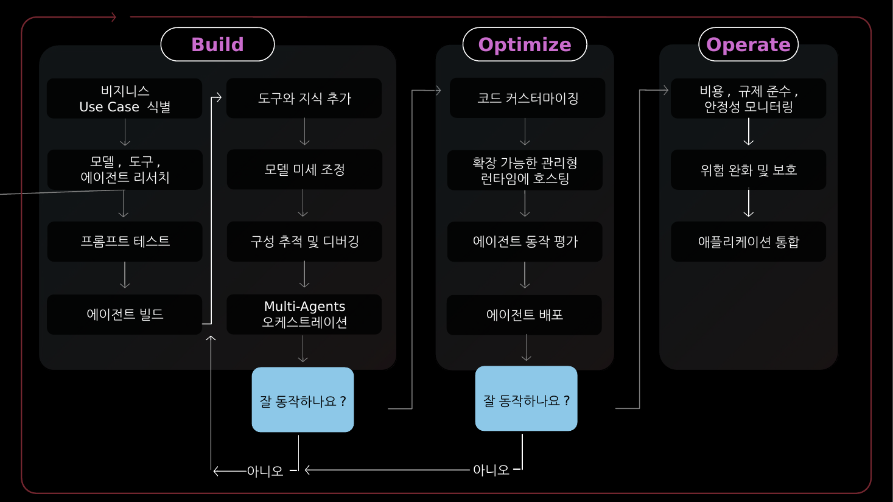
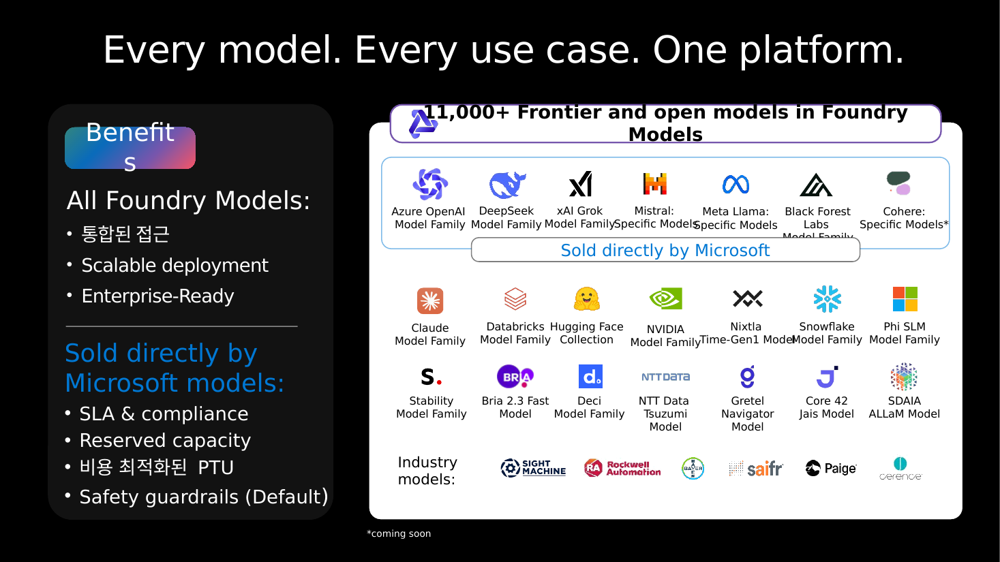
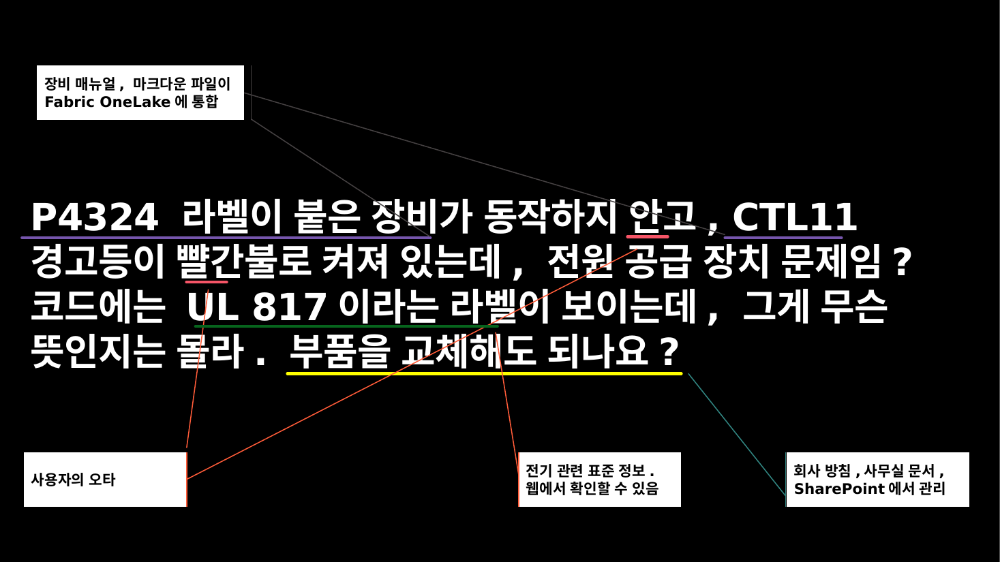
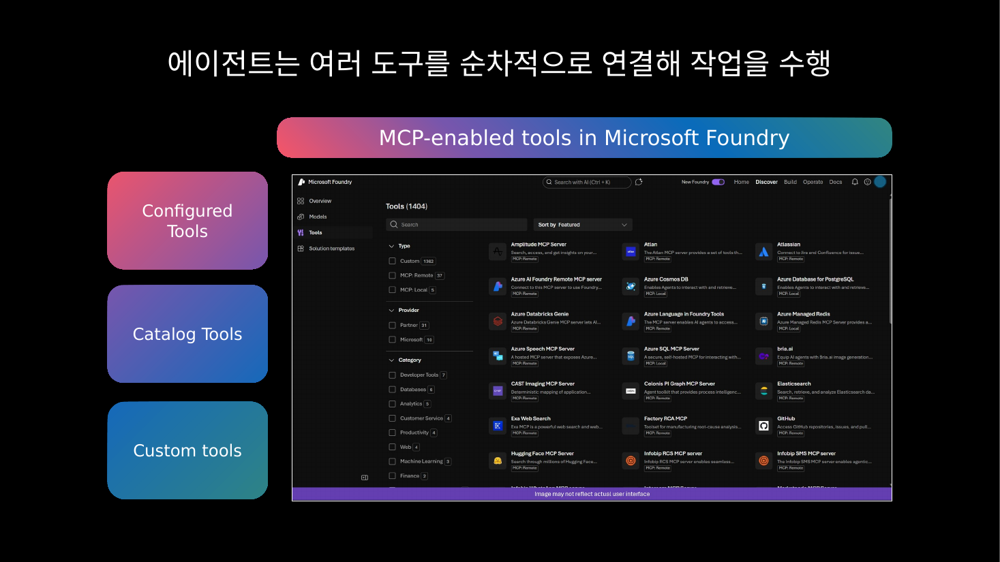
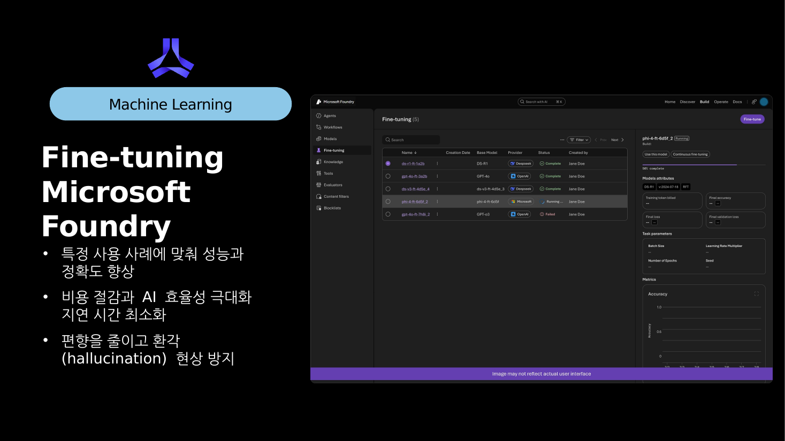

# 📦 Microsoft Foundry를 활용한 Agentic AI — 2026-06-04 01:59:19 KST

[📄 PDF](./Microsoft%20Foundry%EB%A5%BC%20%ED%99%9C%EC%9A%A9%ED%95%9C%20Agentic%20AI.pdf) · [📊 PPTX 다운로드](./Microsoft%20Foundry%EB%A5%BC%20%ED%99%9C%EC%9A%A9%ED%95%9C%20Agentic%20AI.pptx) · [📝 summary.md](./summary.md) · [🔗 updates.json](./updates.json)

## ✍️ LLM 요약

Agentic AI 최신 업데이트
- **Azure Monitor Simple Log Alerts** 가 GA로 전환되어 간단한 로그 알림 구성이 쉬워졌습니다. (Azure Updates)
- **Foundry Agents in VS Code Observability** 가 Public Preview로 제공되어 코드 중심 추적이 강화되었습니다. (Azure Updates)
- **Azure Cosmos DB Agent Kit** 이 GA로 제공되어 에이전트 개발 구현 패턴을 빠르게 적용할 수 있습니다. (Azure Updates)
- **Azure SQL 업데이트(6월 초)** 가 Public Preview로 공개되어 데이터 워크로드 기능이 확장되었습니다. (Azure Updates)
- **Azure Files on macOS with Entra ID** 가 Public Preview로 제공되어 보안 파일 접근 시나리오가 강화되었습니다. (Azure Updates)

## 🆕 추가된 슬라이드 (Latest Azure Updates)

## 📑 전체 슬라이드

### Slide 1

### Slide 2

### Slide 3

### Slide 4

### Slide 5

### Slide 6

### Slide 7

### Slide 8

### Slide 9

### Slide 10

### Slide 11

### Slide 12

### Slide 13

### Slide 14

### Slide 15

### Slide 16

### Slide 17

### Slide 18

### Slide 19

### Slide 20

### Slide 21

### Slide 22

### Slide 23

### Slide 24

### Slide 25

### Slide 26

### Slide 27

### Slide 28

### Slide 29

