# 📦 Microsoft Foundry를 활용한 Agentic AI — 2026-06-08 09:23:39 KST

[📄 PDF](./Microsoft%20Foundry%EB%A5%BC%20%ED%99%9C%EC%9A%A9%ED%95%9C%20Agentic%20AI.pdf) · [📊 PPTX 다운로드](./Microsoft%20Foundry%EB%A5%BC%20%ED%99%9C%EC%9A%A9%ED%95%9C%20Agentic%20AI.pptx) · [📝 summary.md](./summary.md) · [🔗 updates.json](./updates.json)

## ✍️ LLM 요약

**Azure 최신 업데이트 요약**

- **Metrics Usage Insights**에 새로운 Ingestion Volume Change 대시보드 추가 (Azure Updates)
- **Azure Boost**를 통한 Guest RDMA 프리뷰 제공, 저지연 네트워킹 지원 (Azure Updates)
- **Voice Live API**에서 아바타 음성 동기화 기능 지원 시작 (Azure Updates)
- **Azure Migrate**로 SMB 및 NFS 파일 공유의 발견 및 평가 기능 제공 (Azure Updates)
- **AI HorizonDB**에서 AI 파이프라인 기능 공개 프리뷰 (Azure Updates)
- **Azure Monitor**에서 OpenTelemetry 신호의 네이티브 수집 기능 일반 제공 (Azure Updates)

## 🆕 추가된 슬라이드 (Latest Azure Updates)

## 📑 전체 슬라이드

### Slide 1

### Slide 2

### Slide 3

### Slide 4

### Slide 5

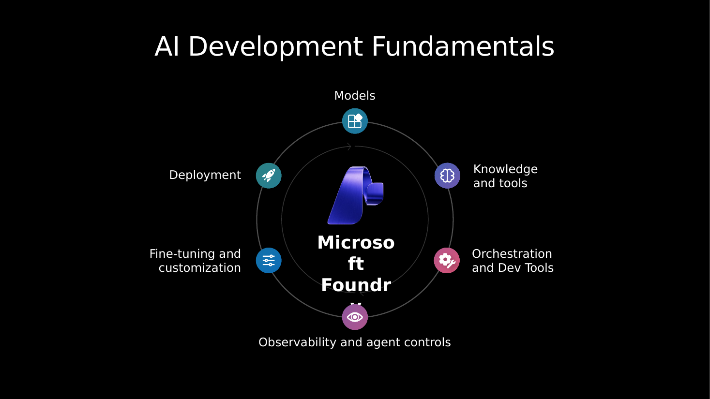

### Slide 6

### Slide 7

### Slide 8

### Slide 9

### Slide 10

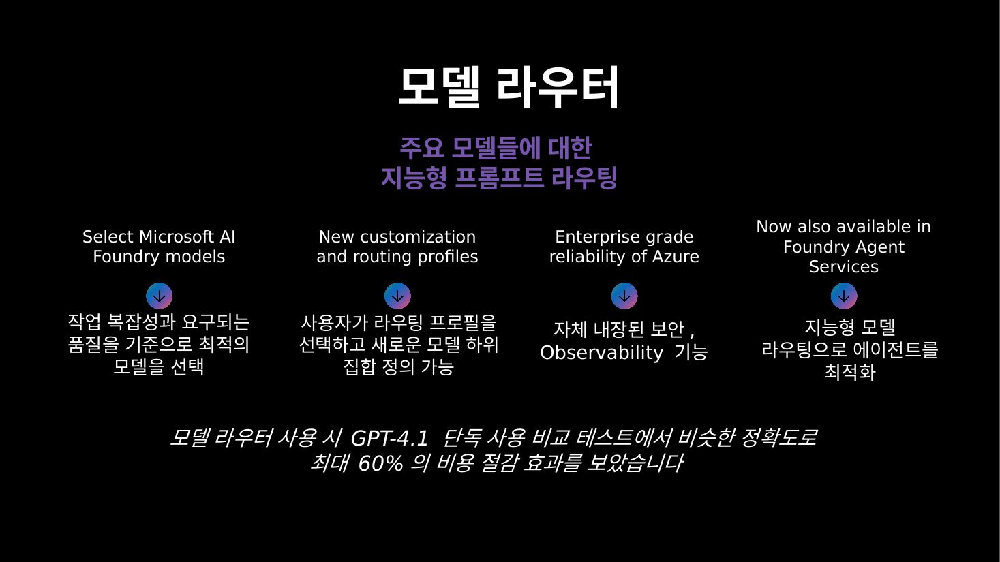

### Slide 11

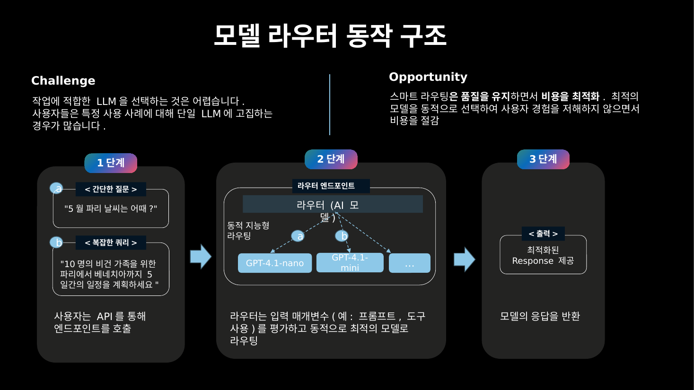

### Slide 12

### Slide 13

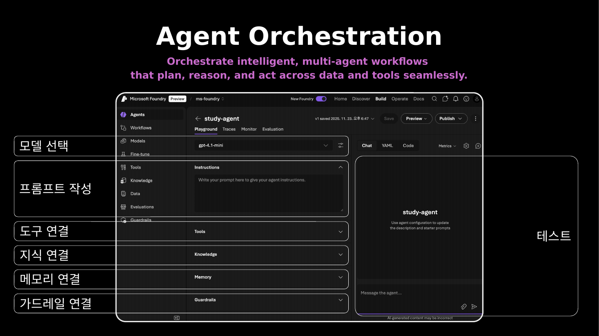

### Slide 14

### Slide 15

### Slide 16

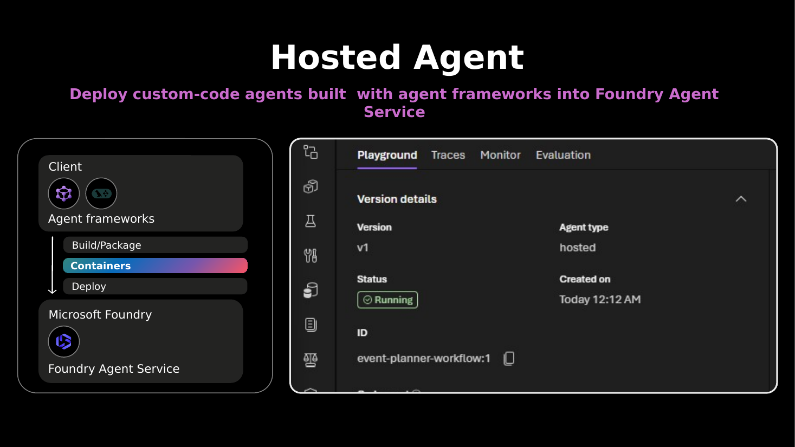

### Slide 17

### Slide 18

### Slide 19

### Slide 20

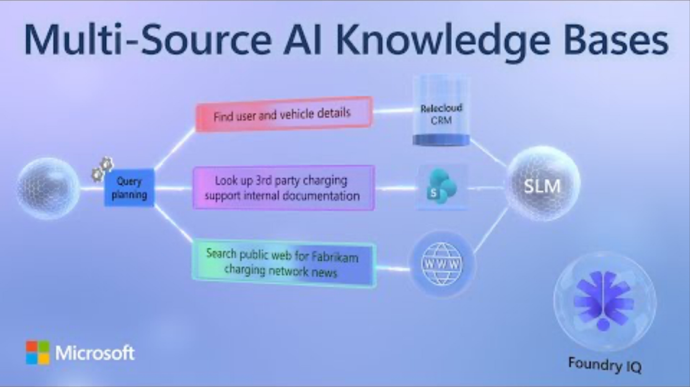

### Slide 21

### Slide 22

### Slide 23

### Slide 24

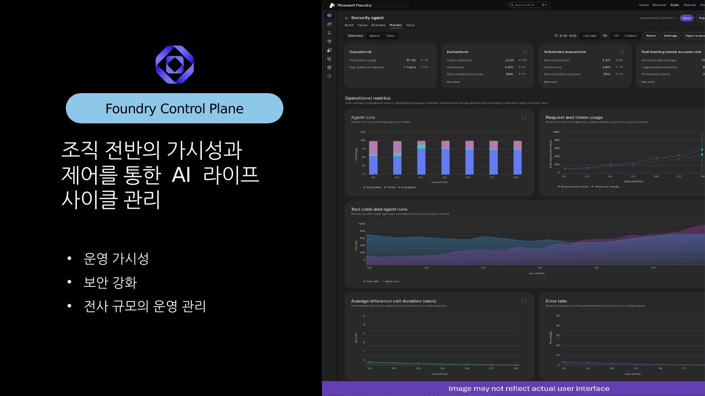

### Slide 25

### Slide 26

### Slide 27

### Slide 28

### Slide 29

### Slide 30

### Slide 31

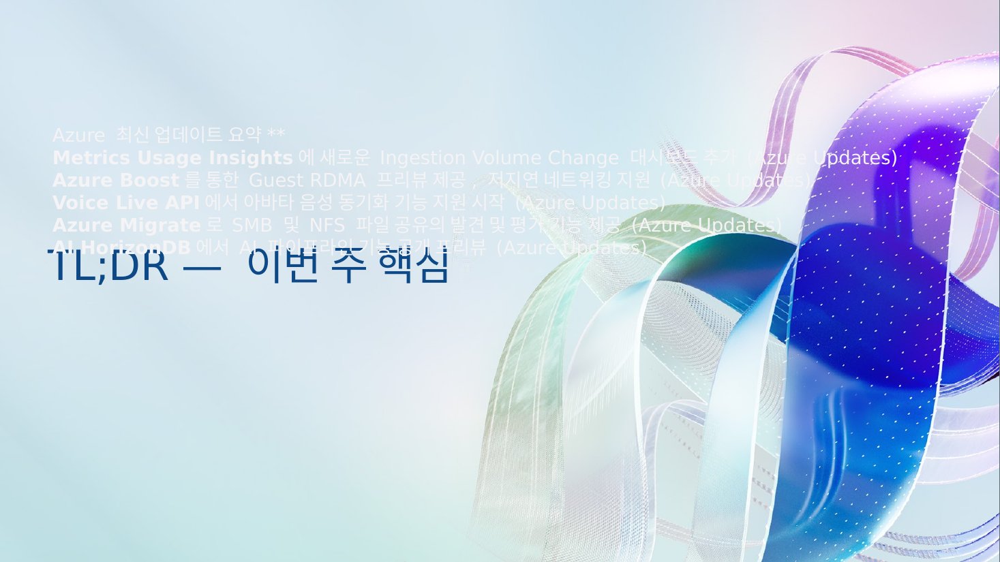

### Slide 32

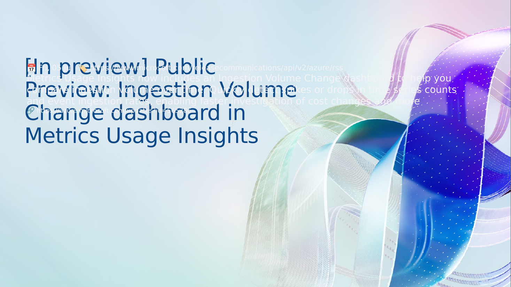

### Slide 33

### Slide 34

### Slide 35

### Slide 36

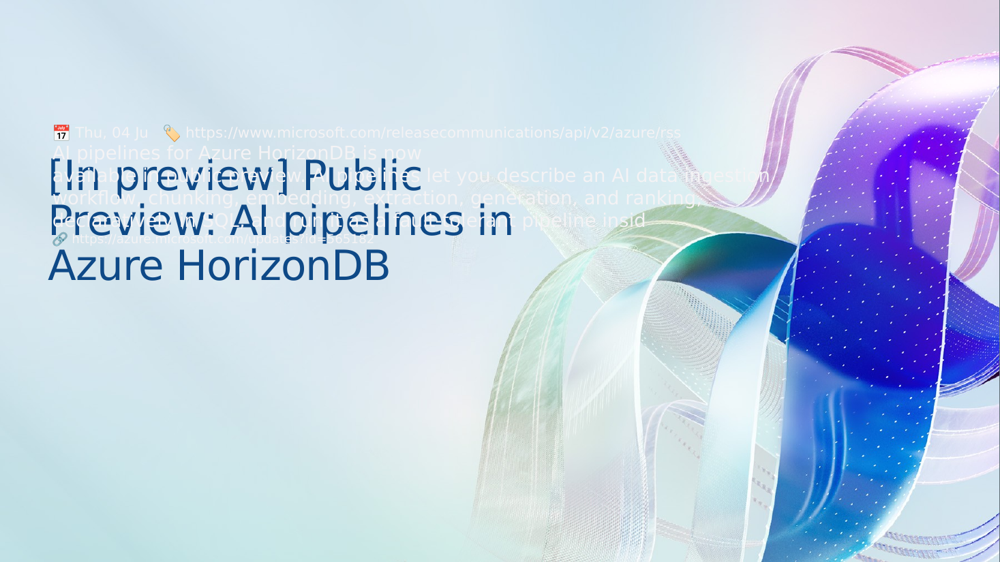

### Slide 37

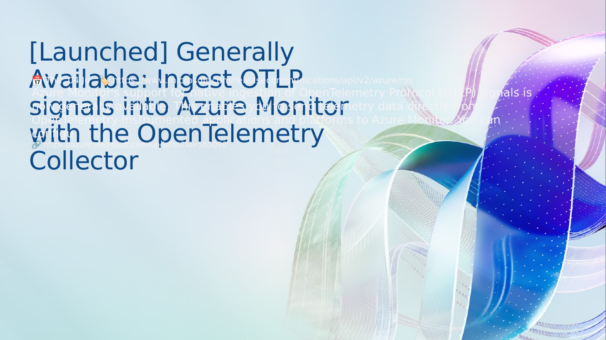

### Slide 38

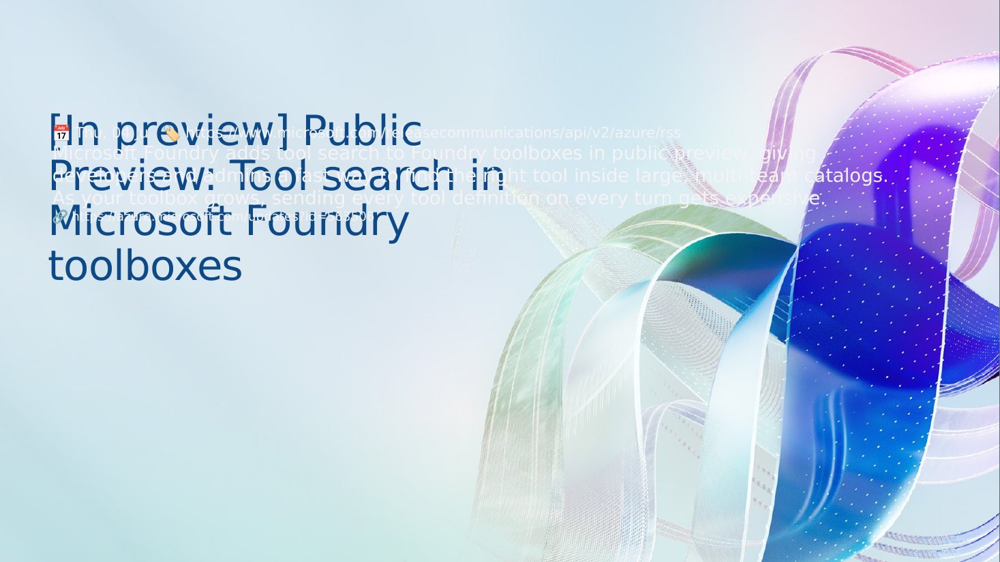

### Slide 39

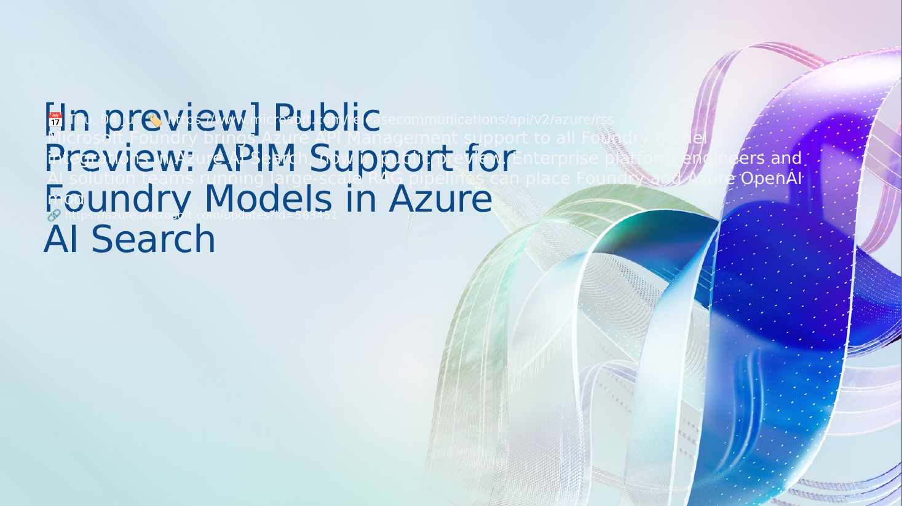

### Slide 40

