# 📦 Microsoft Foundry를 활용한 Agentic AI — 2026-06-15 09:23:53 KST

[📄 PDF](./Microsoft%20Foundry%EB%A5%BC%20%ED%99%9C%EC%9A%A9%ED%95%9C%20Agentic%20AI.pdf) · [📊 PPTX 다운로드](./Microsoft%20Foundry%EB%A5%BC%20%ED%99%9C%EC%9A%A9%ED%95%9C%20Agentic%20AI.pptx) · [📝 summary.md](./summary.md) · [🔗 updates.json](./updates.json)

## ✍️ LLM 요약

Azure 최신 업데이트

- **Azure Batch**의 Av2, F, G, Lsv2 시리즈 VM이 2028년 11월 15일에 퇴출됩니다. (Azure Updates)
- **Azure Batch**의 D, Ds, Ls 시리즈 VM이 2028년 5월 1일에 퇴출됩니다. (Azure Updates)
- **GPv1** 스토리지 계정의 생성이 종료되며, 성능과 비용 효율성을 개선합니다. (Azure Updates)
- **SQL MCP Server**가 일반 제공되며, 안전한 데이터 접근을 지원합니다. (Azure Updates)
- **Azure Load Balancer**의 Inbound NAT 규칙 버전 1이 퇴출됩니다. (Azure Updates)
- **Microsoft Entra** 서버 주체가 Azure SQL Database에서 일반 제공됩니다. (Azure Updates)
- **Azure Cosmos DB NoSQL**의 Azure Synapse Link가 2026년 3월 31일에 종료됩니다. (Azure Updates)
- **Azure VPN Client for Linux**(Preview)가 2026년 8월 31일에 퇴출됩니다. (Azure Updates)

## 🆕 추가된 슬라이드 (Latest Azure Updates)

## 📑 전체 슬라이드

### Slide 1

### Slide 2

### Slide 3

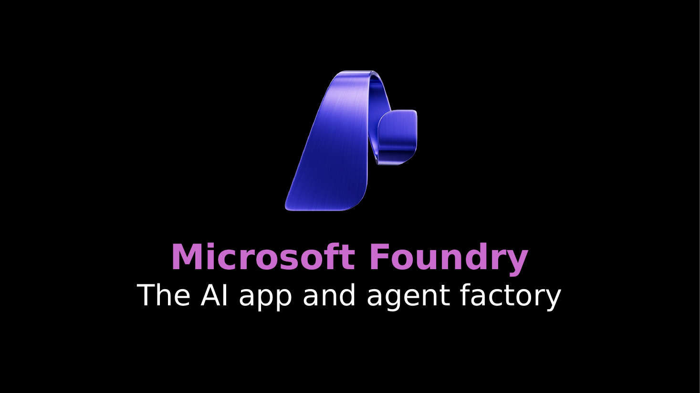

### Slide 4

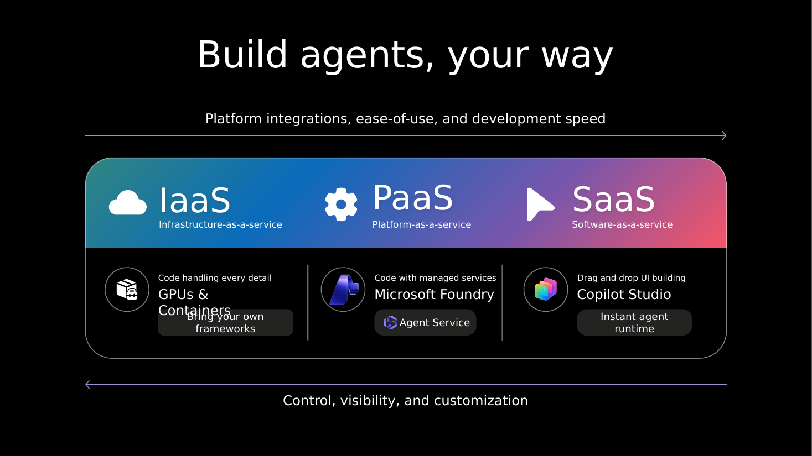

### Slide 5

### Slide 6

### Slide 7

### Slide 8

### Slide 9

### Slide 10

### Slide 11

### Slide 12

### Slide 13

### Slide 14

### Slide 15

### Slide 16

### Slide 17

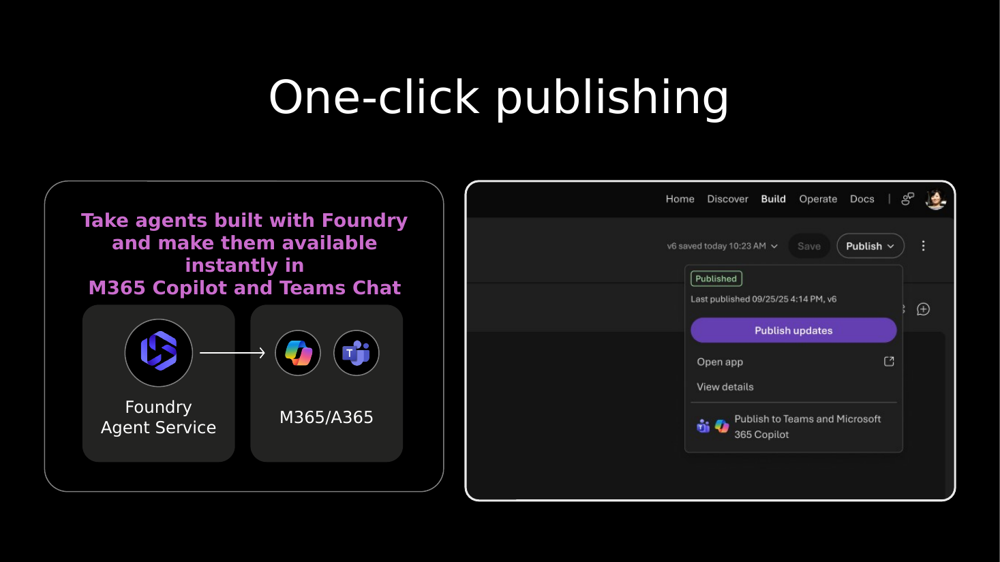

### Slide 18

### Slide 19

### Slide 20

### Slide 21

### Slide 22

### Slide 23

### Slide 24

### Slide 25

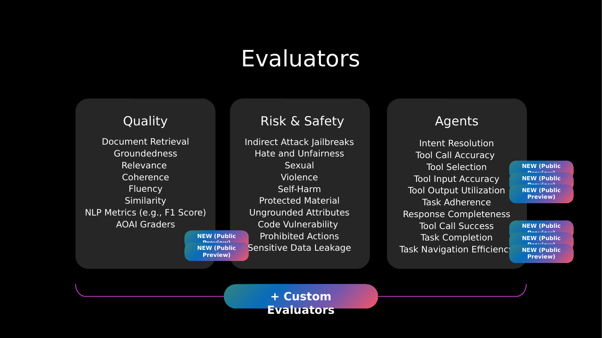

### Slide 26

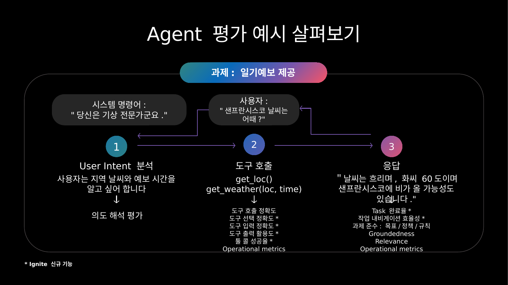

### Slide 27

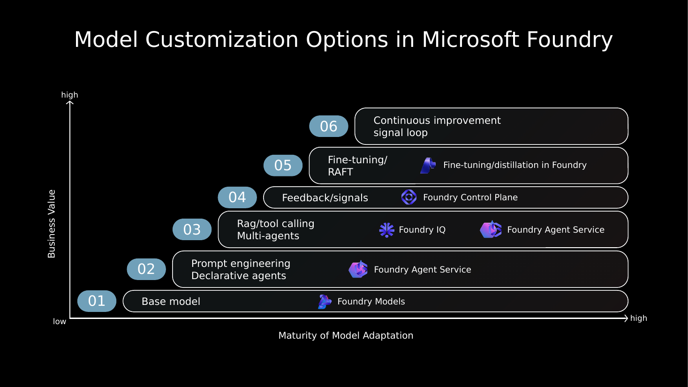

### Slide 28

### Slide 29

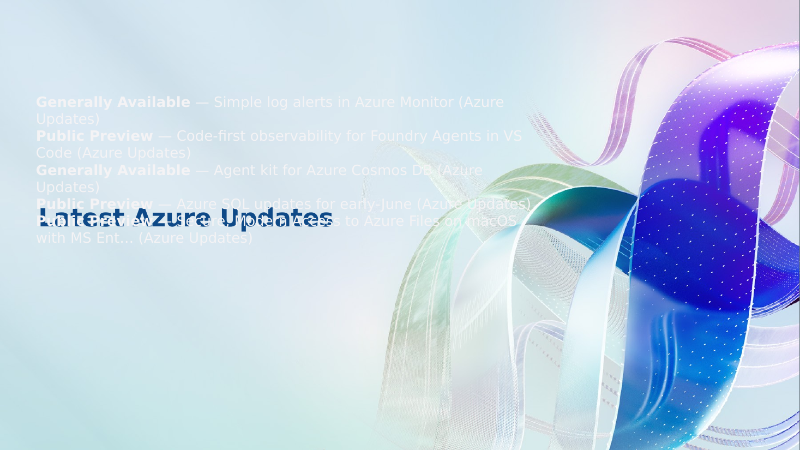

### Slide 30

### Slide 31

### Slide 32

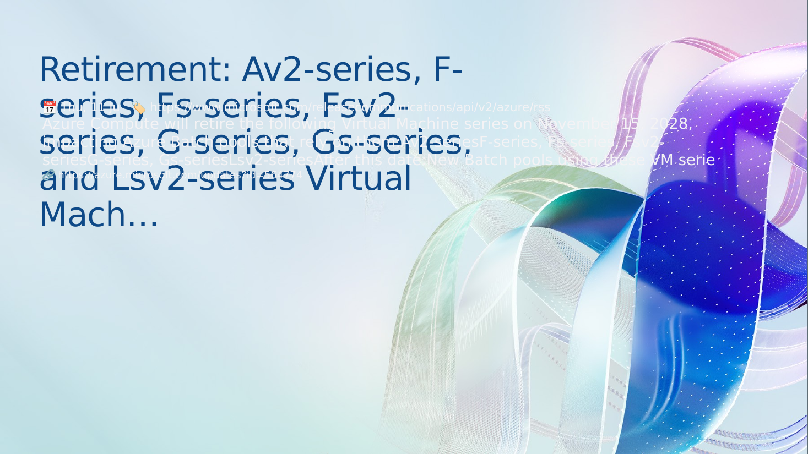

### Slide 33

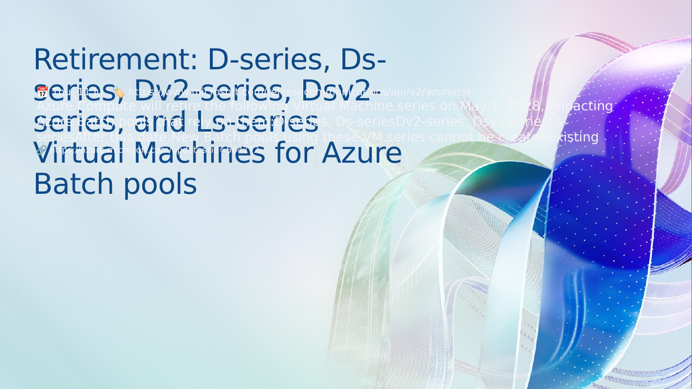

### Slide 34

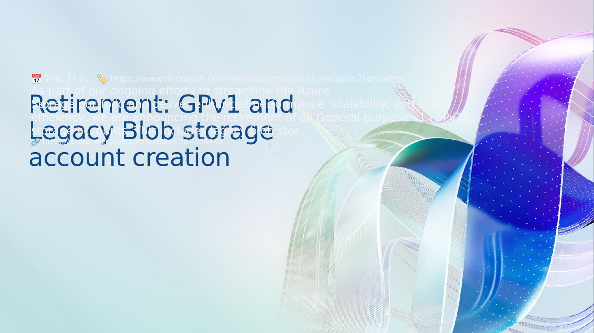

### Slide 35

### Slide 36

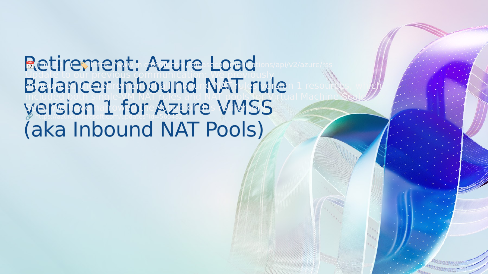

### Slide 37

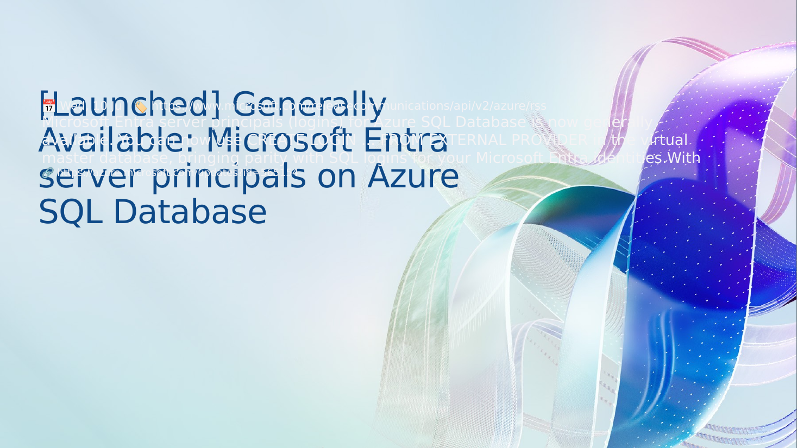

### Slide 38

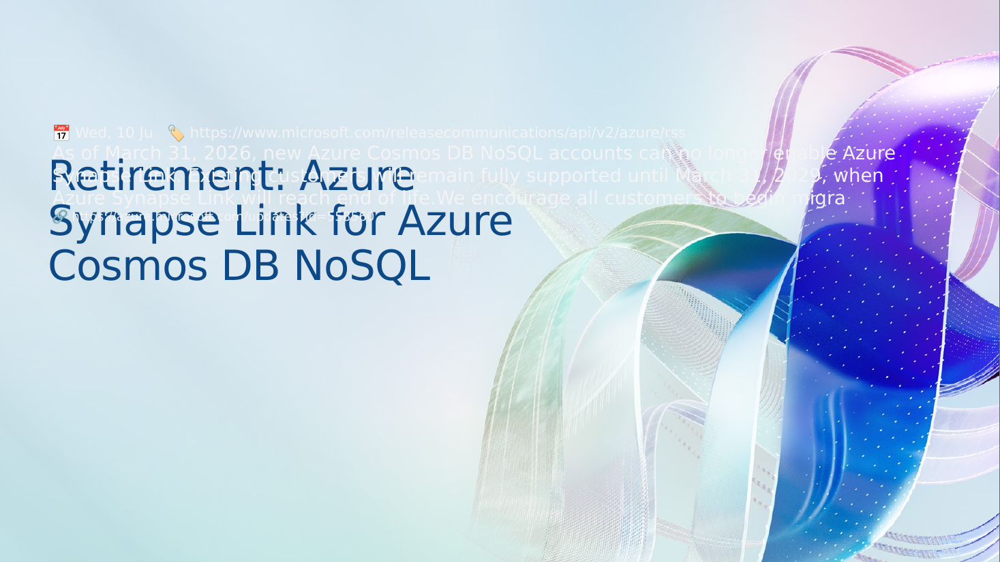

### Slide 39

### Slide 40

